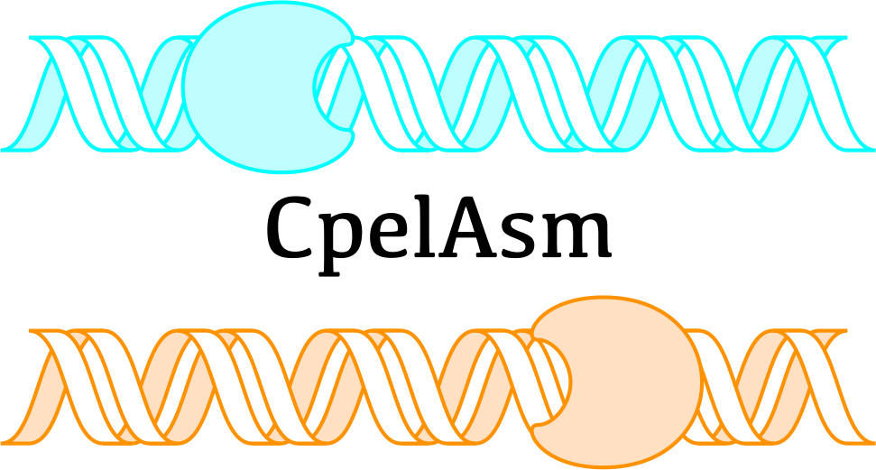

#  CpelAsm


[](https://github.com/jordiabante/CpelAsm.jl/blob/master/LICENSE.md)

## Description

CpelAsm is a julia package especifically desgined for haplotype allele-specific
methylation based on the method in [1]. CpelAsm draws ideas from statistical
physics and information theory to detect allele-specific methylation imbalances
at the haplotype level.

## Testing

CpelAsm is tested against Julia `1.3.0` on the latest versions of Linux, macOS
and Windows.

## Getting Started

### Prerequisites

* julia v1.3.0
* git.

### Installing

The `CpelAsm` version in [1] and dependencies can be installed via the following 
command in julia's REPL:

```julia
julia> using Pkg
julia> Pkg.add(url="https://github.com/jordiabante/CpelAsm.jl.git",version="0.0.1")
```

## Running the tests

In a `julia` session run

```julia
(v1.3) pkg> test CpelAsm
```

## Toy Example

The package includes a small toy example for illustrative purposes.
The example consists of two alleles `a1` and `a2`. The former has a
mean-methylation level (MML) of 0.8, while that of the later is 0.2.
Nevertheless, given the symmetry of the problem, both alleles have
the same Shannon entropy. Thus, differential  analysis only identifies
differences in terms of MML. The output bedGraph files can be found
in `out_path`. To run the toy example run the following commands in
a `julia`'s REPL:

```julia
using CpelAsm
dir = "/path/to/CpelAsm.jl/test/"
b1 = "$(dir)/bam/example.a1.bam"
b2 = "$(dir)/bam/example.a2.bam"
fa = "$(dir)/fasta/n-masked/example.fa"
vcf = "$(dir)/vcf/example.vcf"
out = "$(dir)/out/"
run_analysis(b1,b2,b1,vcf,fa,out;win_exp=10,n_null=1000,cov_ths=5)
```

## Main Commands

### Generate GFF files

The first step consists in generating the 2 necessary GFF files: heterozygous and homozygous.
The former is the one that contains the haplotypes analyzed, while the latter contains the
homozygous regions of the genome.

In the following example, the maximum number of CpG sites allowed per haplotype is 25 (`n_max=25`). 
In addition, CpelAsm extends the window delimited by the first and last SNP in the haplotype by 100 
bp left and right (`win_exp=100`).

```julia
# Parameters
n_max = 25
win_exp = 100

# Paths
project_path = "/path/to/SampleName"
vcf = "$(project_path)/vcf/SampleName.phased.vcf"
fasta = "$(project_path)/fasta/SampleName.masked_hg19.fa"
het_gff = "$(project_path)/CpelAsmOut/SampleName_het.cpelasm.gff"
hom_gff = "$(project_path)/CpelAsmOut/SampleName_hom.cpelasm.gff"

# Call
gen_gffs([het_gff,hom_gff],fasta,vcf,win_exp,n_max)

```

### BedGraphs MML, NME, & PDM

The next step consists in estimating the allele-specific Ising models in the haplotypes
and generating bedGraph files with MML1/2, NME1/2, and PDM. CpelAsm can be parallelized 
when multiple CPUs are available by loading first the package `Distributed` and then 
loading CpelAsm through the macro ``@everywhere`.

In the following example, the maximum size of a subregion is fixed to 500 (`g_max=500`), 
the minimum average depth is set to 5 (`cov_ths=5`), and the WGBS reads are trimmed 5 bp
on each end (`trim=(5,5,5,5)`).

```julia
# Deps
using Distributed
@everywhere using CpelAsm

# Parameters
g_max = 500
cov_ths = 5
trim = (5,5,5,5)

# Paths
project_path = "/path/to/SampleName"
fasta = "$(project_path)/fasta/SampleName.masked_hg19.fa"
het_gff = "$(project_path)/cpelasm/SampleName_het.cpelasm.gff"
bam1 = "$(project_path)/bam/SampleName.sort.genome1.bam"
bam2 = "$(project_path)/bam/SampleName.sort.genome2.bam"
pdm_path = "$(project_path)/cpelasm/SampleName_pdm.bedGraph"
mml1_path = "$(project_path)/cpelasm/SampleName_mml1.bedGraph"
mml2_path = "$(project_path)/cpelasm/SampleName_mml2.bedGraph"
nme1_path = "$(project_path)/cpelasm/SampleName_nme1.bedGraph"
nme2_path = "$(project_path)/cpelasm/SampleName_nme2.bedGraph"
tobs_path = [mml1_path,mml2_path,nme1_path,nme2_path,pdm_path]

# Call
comp_tobs(bam1,bam2,het_gff,fasta,tobs_path;g_max=g_max,cov_ths=cov_ths,trim=trim)

```

### Generate Null Statistics

The next step consists in generating null statistics to be able to perform hypothesis
testing. As discussed in the previous point, CpelAsm can be parallelized when multiple 
CPUs are available by first loading the package `Distributed` and then loading CpelAsm 
through the macro ``@everywhere`.

In the following example, the maximum size of a subregion is fixed to 500 (`g_max=500`), 
the minimum average depth is set to 5 (`cov_ths=5`), and the WGBS reads are trimmed 5 bp
on each end (`trim=(5,5,5,5)`).

```julia
# Deps
using Distributed
@everywhere using CpelAsm

# Parameters
cov_ths = 5
g_max = 500
trim = (5,5,5,5)

# Paths
project_path = "/path/to/SampleName"
fasta = "$(project_path)/fasta/SampleName.masked_hg19.fa"
bam1 = "$(project_path)/bam/SampleName.sort.genome1.bam"
bam2 = "$(project_path)/bam/SampleName.sort.genome2.bam"
het_gff = "$(project_path)/cpelasm/SampleName_het.cpelasm.gff"
hom_gff = "$(project_path)/cpelasm/SampleName_hom.cpelasm.gff"
null_pdm_path = "$(project_path)/cpelasm/SampleName_pdm_null.bedGraph"
null_tmml_path = "$(project_path)/cpelasm/SampleName_tmml_null.bedGraph"
null_tnme_path = "$(project_path)/cpelasm/SampleName_tnme_null.bedGraph"
tnull_path = [null_tmml_path,null_tnme_path,null_pdm_path]
pdm_path = "$(project_path)/cpelasm/SampleName_pdm.bedGraph"
mml1_path = "$(project_path)/cpelasm/SampleName_mml1.bedGraph"
mml2_path = "$(project_path)/cpelasm/SampleName_mml2.bedGraph"
nme1_path = "$(project_path)/cpelasm/SampleName_nme1.bedGraph"
nme2_path = "$(project_path)/cpelasm/SampleName_nme2.bedGraph"
tobs_path = [mml1_path,mml2_path,nme1_path,nme2_path,pdm_path]

# Call
comp_tnull(bam,het_gff,hom_gff,fasta,tobs_path,tnull_path;
    g_max=g_max,cov_ths=cov_ths,trim=trim,n_max=n_max)

```

### Perform Allele-Specific Methylation Detection

The final step is to compute a p-value for each haplotype for each one of the three
quantities (Tmml, Tnme, Tpdm). The returned p-values are corrected using the
Benjamini-Hochberg and allow for control of the false discovery rate (FDR).

In the following example, hypothesis testing is performed for haplotypes with at
most 25 CpG sites (`n_max=25`), and a minimum of 1,000 null statistics to perform
hypothesis testing.

```julia
# Deps
using CpelAsm

# Parameters
n_max = 25
n_null = 1000

# Paths
project_path = "/path/to/SampleName"
fasta = "$(project_path)/fasta/SampleName.masked_hg19.fa"
bam1 = "$(project_path)/bam/SampleName.sort.genome1.bam"
bam2 = "$(project_path)/bam/SampleName.sort.genome2.bam"
null_pdm_path = "$(project_path)/cpelasm/SampleName_pdm_null.bedGraph"
null_tmml_path = "$(project_path)/cpelasm/SampleName_tmml_null.bedGraph"
null_tnme_path = "$(project_path)/cpelasm/SampleName_tnme_null.bedGraph"
tnull_path = [null_tmml_path,null_tnme_path,null_pdm_path]
pdm_path = "$(project_path)/cpelasm/SampleName_pdm.bedGraph"
mml1_path = "$(project_path)/cpelasm/SampleName_mml1.bedGraph"
mml2_path = "$(project_path)/cpelasm/SampleName_mml2.bedGraph"
nme1_path = "$(project_path)/cpelasm/SampleName_nme1.bedGraph"
nme2_path = "$(project_path)/cpelasm/SampleName_nme2.bedGraph"
tobs_path = [mml1_path,mml2_path,nme1_path,nme2_path,pdm_path]
pVal_tmml_path = "$(project_path)/cpelasm/SampleName_tmml_pvals.bedGraph"
pVal_tnme_path = "$(project_path)/cpelasm/SampleName_tnme_pvals.bedGraph"
pVal_tpdm_path = "$(project_path)/cpelasm/SampleName_tpdm_pvals.bedGraph"
pVal_path = [pVal_tmml_path,pVal_tnme_path,pVal_tpdm_path]

# Call
comp_pvals(tobs_path,tnull_path,p_path,n_max,n_null)

```

### Running CpelAsm with a single command

The following example shows how to perform all the steps shown above in a single command.

```julia
# Deps
using Distributed
@everywhere using CpelAsm

# Parameters
cov_ths = 5
g_max = 500
win_exp = 100
trim = (5,5,5,5)

# Paths
project_path = "/path/to/SampleName"
vcf = "$(project_path)/vcf/SampleName.phased.vcf"
fasta = "$(project_path)/fasta/SampleName.masked_hg19.fa"
bam1 = "$(project_path)/bam/SampleName.sort.genome1.bam"
bam2 = "$(project_path)/bam/SampleName.sort.genome2.bam"
bamu = "$(project_path)/bam/SampleName.sort.unassigned.bam"
outdir = "$(project_path)/cpelasm/"

# Call
run_analysis(bam1,bam2,bamu,vcf,fasta,outdir;g_max=g_max,cov_ths=cov_ths,
    win_exp=win_exp,trim=trim,n_null=n_null,n_max=n_max)

```

## Authors

* **Jordi Abante**

## License

This project is licensed under the MIT License - see the [LICENSE.md](LICENSE.md)
file for details.

## References

[1] Abante, J., Fang, Y., Feinberg, A.P., Goutsias, J., Detection of haplotype-dependent
allele-specific DNA methylation in WGBS data, *Nature Communications* 2020 XYZ.
